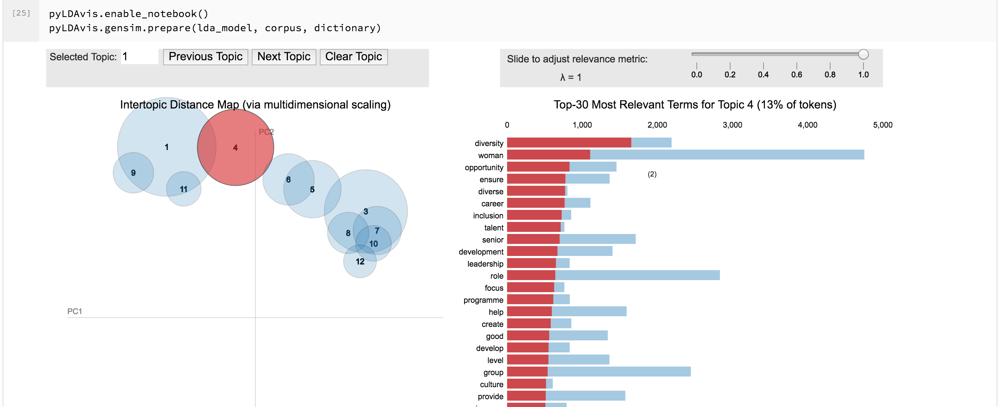

# gender-pay-gap-nlp

You can download all the gender pay gap figures from the [gov.uk website](https://gender-pay-gap.service.gov.uk/viewing/download). One of the fields is the url to the companies diversity reports, some are web pages, some are pdfs.

This project downloads that content and performs a series of experiments to see if we can find out any patterns, topics or differences between what people score on gender pay gap statistics and how they talk about the subject.

## Generating/downloading the data

## Topic Analysis

Notebook: lda_viz.ipynb

The idea here is have a look at the key topics talked about and group then automatically into topic areas. For this we used LDA and LDAViz to examine the results.

